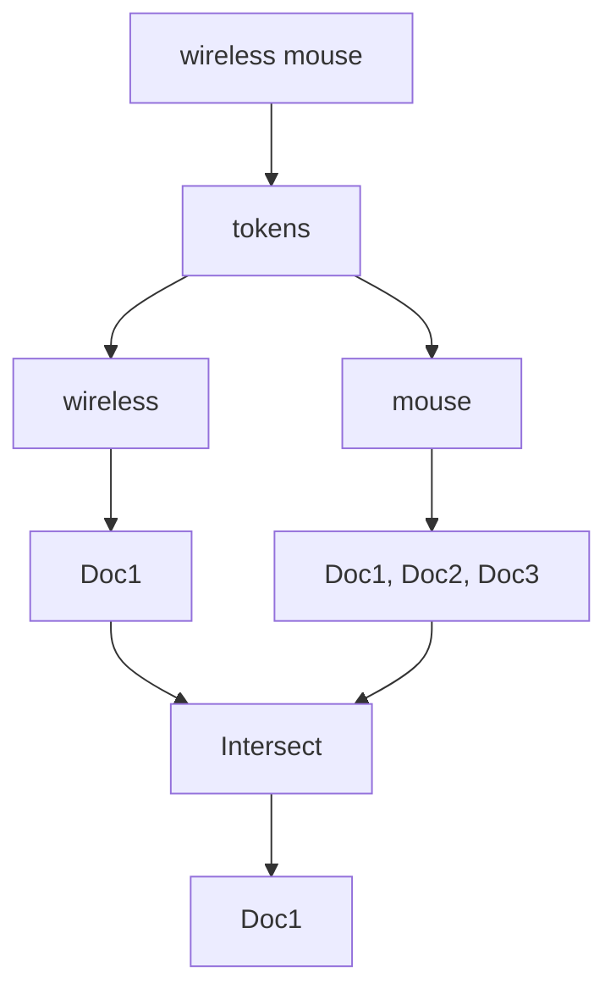

# The Inverted Index

| Term      | Documents       |
|----------|----------------|
| wireless | 1              |
| mouse    | 1, 2, 3        |
| gaming   | 2              |
| bluetooth| 3              |

---

## Query: "wireless mouse"

- wireless → 1  
- mouse → 1, 2, 3  

Intersection → 1

---

## Visualization

 Speaker Notes 

- Start with: "Imagine we scan every document — too slow"
- Emphasize: "We precompute this structure"
- Walk through the table slowly
- Ask: "Which document contains both words?"
- Pause before saying "intersection"

