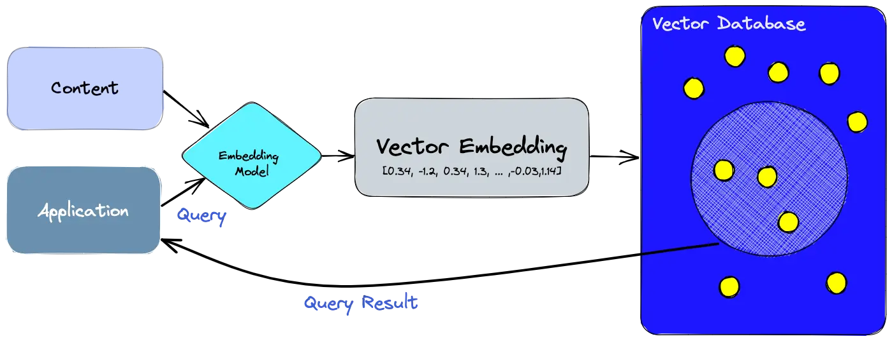

# Vector Databases

A vector database indexes and stores vector embeddings for fast retrieval and similarity search, with capabilities like CRUD operations, metadata filtering, horizontal scaling, and serverless.

---

---

## Key Technologies:

- **HNSW (Hierarchical Navigable Small World)**: A graph-based approach that allows for lightning-fast lookups.

- **Product Quantization (PQ)**: Compressing vectors to save memory.

- **Vector DBs**: Tools like Qdrant, Weaviate, or Pinecone manage these indexes and provide CRUD operations for vectors.

- **AlloyDB**: Handles vector at scale using `pgvector` extension. It introduces a `VECTOR` column. It supports IVFFlat and HNSW directly within the SQL environment. You use standard SQL with vector operators (like <-> for Euclidean distance or <#> for inner product).

